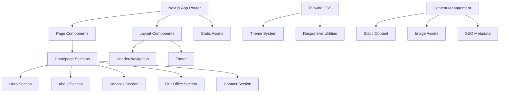

# Design Document

## Overview

This design document outlines the technical architecture and implementation approach for the Front-End Developer internship assignment. The system will be built as a Next.js application with Tailwind CSS, transforming the Lilac template into a professional therapy practice website for Dr. Maya Reynolds.

The design follows a component-based architecture that enables accurate template cloning while supporting theme customization and content management. The system prioritizes responsive design, performance, and SEO optimization to meet all evaluation criteria.

## Architecture

### System Architecture

The application follows a modern React-based architecture using Next.js:



### Technology Stack

- **Framework**: Next.js 14+ with App Router
- **Styling**: Tailwind CSS with custom theme configuration
- **Deployment**: Vercel or Netlify
- **Version Control**: Git with public GitHub repository
- **Image Optimization**: Next.js Image component with WebP support
- **SEO**: Next.js Metadata API for structured data

### File Structure

```
src/
├── app/
│   ├── layout.tsx          # Root layout with theme provider
│   ├── page.tsx            # Homepage component
│   ├── globals.css         # Global styles and Tailwind imports
│   └── metadata.ts         # SEO metadata configuration
├── components/
│   ├── sections/
│   │   ├── Hero.tsx        # Hero section component
│   │   ├── About.tsx       # About Dr. Maya section
│   │   ├── Services.tsx    # Services and specializations
│   │   ├── OurOffice.tsx   # Custom office section
│   │   └── Contact.tsx     # Contact information section
│   ├── ui/
│   │   ├── Button.tsx      # Reusable button component
│   │   ├── Card.tsx        # Card component for content blocks
│   │   └── Navigation.tsx  # Header navigation component
│   └── layout/
│       ├── Header.tsx      # Site header
│       └── Footer.tsx      # Site footer
├── lib/
│   ├── constants.ts        # Site constants and content
│   └── utils.ts           # Utility functions
├── public/
│   ├── images/            # Optimized images
│   └── favicon.ico        # Site favicon
└── styles/
    └── components.css     # Component-specific styles
```

## Components and Interfaces

### Core Component Architecture

**Layout Components**:
- `RootLayout`: Provides theme context and global styling
- `Header`: Navigation with responsive mobile menu
- `Footer`: Contact information and social links

**Section Components**:
- `HeroSection`: Main banner with call-to-action
- `AboutSection`: Dr. Maya's bio and credentials
- `ServicesSection`: Therapy specializations and approaches
- `OurOfficeSection`: Custom office environment description
- `ContactSection`: Contact form and office information

**UI Components**:
- `Button`: Consistent button styling with variants
- `Card`: Content containers with consistent spacing
- `Image`: Optimized image component with lazy loading

### Component Interfaces

```typescript
interface SectionProps {
  className?: string;
  children?: React.ReactNode;
}

interface ButtonProps {
  variant: 'primary' | 'secondary' | 'outline';
  size: 'sm' | 'md' | 'lg';
  children: React.ReactNode;
  onClick?: () => void;
  href?: string;
}

interface CardProps {
  title?: string;
  content: string;
  image?: string;
  className?: string;
}
```

### Theme System Architecture

The theme system uses Tailwind CSS custom configuration:

```javascript
// tailwind.config.js
module.exports = {
  theme: {
    extend: {
      colors: {
        primary: {
          50: '#f0f9ff',
          500: '#3b82f6',
          900: '#1e3a8a'
        },
        secondary: {
          50: '#f8fafc',
          500: '#64748b',
          900: '#0f172a'
        },
        accent: {
          50: '#fef3c7',
          500: '#f59e0b',
          900: '#78350f'
        }
      },
      fontFamily: {
        sans: ['Inter', 'system-ui', 'sans-serif'],
        serif: ['Playfair Display', 'serif']
      }
    }
  }
}
```

## Data Models

### Content Data Structure

```typescript
interface TherapistProfile {
  name: string;
  title: string;
  license: string;
  location: string;
  specializations: string[];
  approaches: string[];
  clientTypes: string[];
  sessionTypes: string[];
  bio: string;
  image: string;
}

interface OfficeInfo {
  address: {
    street: string;
    city: string;
    state: string;
    zipCode: string;
  };
  description: string;
  features: string[];
  images: string[];
}

interface SEOMetadata {
  title: string;
  description: string;
  keywords: string[];
  structuredData: {
    '@type': 'LocalBusiness';
    name: string;
    address: Address;
    telephone: string;
    url: string;
  };
}
```

### Static Content Management

Content is managed through TypeScript constants for type safety:

```typescript
// lib/constants.ts
export const THERAPIST_PROFILE: TherapistProfile = {
  name: "Dr. Maya Reynolds",
  title: "Licensed Clinical Psychologist",
  license: "PSY 12345",
  location: "Santa Monica, CA",
  specializations: ["Anxiety", "Panic Disorders", "Trauma", "Burnout"],
  approaches: ["CBT", "EMDR", "Mindfulness", "Body-Oriented Techniques"],
  clientTypes: ["High-achieving adults", "Overwhelmed professionals"],
  sessionTypes: ["In-person", "Telehealth"],
  bio: "Dr. Maya Reynolds is a licensed clinical psychologist...",
  image: "/images/dr-maya-reynolds.jpg"
};
```

## Error Handling

### Client-Side Error Boundaries

```typescript
interface ErrorBoundaryState {
  hasError: boolean;
  error?: Error;
}

class SectionErrorBoundary extends React.Component<Props, ErrorBoundaryState> {
  // Graceful degradation for section failures
  // Fallback UI for individual sections
  // Error reporting for debugging
}
```

### Image Loading Fallbacks

- Progressive image loading with blur placeholders
- Fallback images for missing assets
- Alt text for accessibility compliance

### Responsive Design Error Handling

- Graceful degradation on unsupported browsers
- Fallback layouts for extreme screen sizes
- Touch interaction fallbacks for desktop

## Testing Strategy

*A property is a characteristic or behavior that should hold true across all valid executions of a system—essentially, a formal statement about what the system should do. Properties serve as the bridge between human-readable specifications and machine-verifiable correctness guarantees.*

### Correctness Properties

Based on the prework analysis, the following properties validate the system's correctness:

**Property 1: Color System Consistency**
*For any* page element that displays color, the color should come from the defined theme palette and no original lilac theme colors should remain
**Validates: Requirements 2.1, 2.4**

**Property 2: Styling Framework Compliance**
*For any* styled element, it should use Tailwind CSS classes without conflicting custom CSS overrides
**Validates: Requirements 5.2, 5.5**

**Property 3: Performance Standards**
*For any* page load or device type, the system should meet performance thresholds (3-second load time, consistent cross-device performance)
**Validates: Requirements 7.1, 7.2**

**Property 4: Interactive Feedback**
*For any* interactive element (navigation, buttons), user interactions should trigger immediate visual feedback
**Validates: Requirements 7.3**

**Property 5: Layout Stability**
*For any* responsive breakpoint transition, the layout should not exhibit cumulative layout shift above acceptable thresholds
**Validates: Requirements 7.4**

**Property 6: Accessibility Compliance**
*For any* page element, it should meet WCAG accessibility standards for users with disabilities
**Validates: Requirements 7.5**

**Property 7: SEO Optimization**
*For any* content element, SEO keywords should be naturally integrated, images should have proper alt text, and heading hierarchy should be maintained
**Validates: Requirements 8.3, 8.4, 8.5**

### Testing Strategy

The testing approach combines unit tests for specific implementation details with property-based tests for universal system behaviors.

**Unit Testing Focus:**
- Specific content verification (Dr. Maya's information, office details)
- Component rendering with correct props
- Navigation functionality and routing
- Form validation and submission
- Image loading and optimization
- SEO metadata presence and accuracy

**Property-Based Testing Focus:**
- Color system consistency across all components
- Responsive design behavior at various breakpoints
- Performance metrics under different conditions
- Accessibility compliance across all interactive elements
- SEO optimization patterns throughout content

**Testing Framework Configuration:**
- **Unit Tests**: Jest with React Testing Library for component testing
- **Property Tests**: Custom property tests using Jest with minimum 100 iterations per property
- **Visual Regression**: Playwright for cross-browser visual testing
- **Performance**: Lighthouse CI for automated performance monitoring
- **Accessibility**: axe-core for automated accessibility testing

**Property Test Tags:**
Each property test must include a comment referencing the design document:
- **Feature: frontend-internship-assignment, Property 1: Color System Consistency**
- **Feature: frontend-internship-assignment, Property 2: Styling Framework Compliance**
- **Feature: frontend-internship-assignment, Property 3: Performance Standards**

**Testing Balance:**
Unit tests handle specific examples and edge cases (content verification, component props), while property tests ensure universal behaviors (performance, accessibility, styling consistency). This dual approach provides comprehensive coverage without redundant testing of the same functionality.